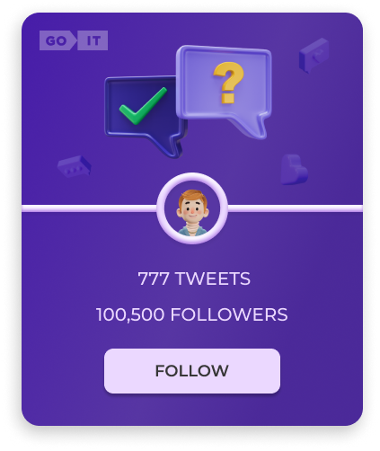
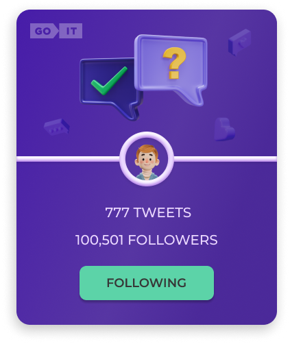

# Followers test task

Create tweet cards and add interactivity when you click on a button.

## Demo

[LINK](https://blackyhat.github.io/followersGoIT)

## Features

- User `cards` according to the template
- When you click on the Follow button, the text changes to Following. Also the
  color of the button changes. And the number of followers is added. When
  updating the page, the final result of the user's actions should be recorded
- The app have two `routes`: '/' - the Home component; '/tweets' - the tweets
  component, the page with tweets displayed. If a user enters the app via a
  non-existent route, the user must be redirected to the home page.
- Add filtering `Dropdown` with 3 options: `show all` - show all tweets,
  `follow` - show tweets that have a follow status, `followings` - show tweets
  with the following status

## Tech Stack

[FrontEnd] React, Redux Toolkit, React Router Dom, Axios, Module CSS [BackEnd]
Mockapi.io
